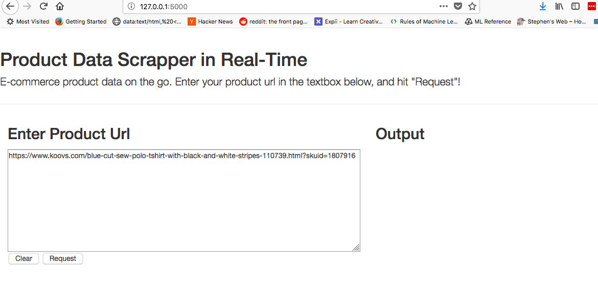
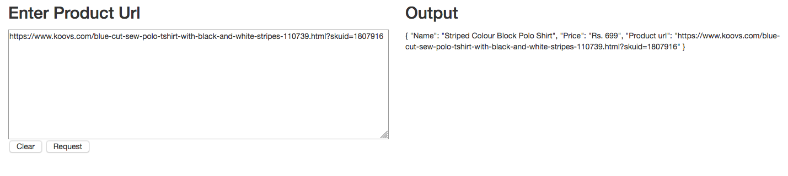
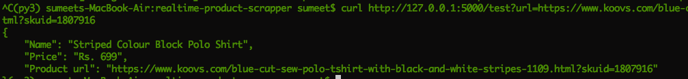

# real-time-product-scrapper

Scraping the product in realtime and provide data via API using flask and beautiful Soup.

Required python3 and flask

Run python scrape.py and go to the http://127.0.0.1:5000/

Hit the request button to call test function and return basic product fields

Or we can hit the end-point using curl and pass the url as parameter

## What's next?
	* Introduce Database
	* Support for top 4-5 e-commerce site
	* Add more fields like description, features and images
	* Login page
	* API's
